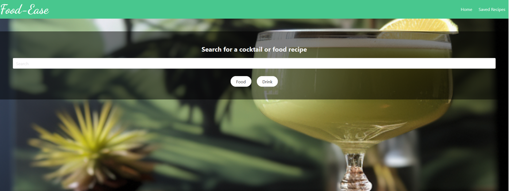

# Food-Ease

## Description
This application is used to find recipes for the user's desired food or drink. Cocktails are the only drinks that this site will be able to display.

https://wowzowski.github.io/food-ease/index.html

## Usage
To use this application you will type your desired item into the search bar. Once the item is in the search bar, depending on weather it is a food or a drink, you click the corresponding button. Once the button is clicked, it will display the results of your search and give you the option to save/remove any of the results. When you choose which one of the results you would like to save, then it will add that to your list of saved items so that you can see them at any time. You can use the navbar at the top to move between the landing page and the saved recipes page so that you can view your recipes at any time as well as go back to the homepage.

## License
MIT License

Copyright (c) 2023 Tbroskii

Permission is hereby granted, free of charge, to any person obtaining a copy
of this software and associated documentation files (the "Software"), to deal
in the Software without restriction, including without limitation the rights
to use, copy, modify, merge, publish, distribute, sublicense, and/or sell
copies of the Software, and to permit persons to whom the Software is
furnished to do so, subject to the following conditions:

The above copyright notice and this permission notice shall be included in all
copies or substantial portions of the Software.

THE SOFTWARE IS PROVIDED "AS IS", WITHOUT WARRANTY OF ANY KIND, EXPRESS OR
IMPLIED, INCLUDING BUT NOT LIMITED TO THE WARRANTIES OF MERCHANTABILITY,
FITNESS FOR A PARTICULAR PURPOSE AND NONINFRINGEMENT. IN NO EVENT SHALL THE
AUTHORS OR COPYRIGHT HOLDERS BE LIABLE FOR ANY CLAIM, DAMAGES OR OTHER
LIABILITY, WHETHER IN AN ACTION OF CONTRACT, TORT OR OTHERWISE, ARISING FROM,
OUT OF OR IN CONNECTION WITH THE SOFTWARE OR THE USE OR OTHER DEALINGS IN THE
SOFTWARE.
